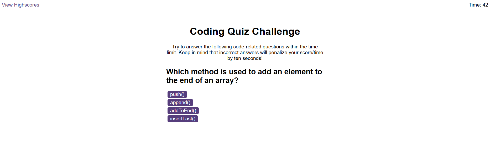

# Coding Quiz Challenge

## Table of Contents
- [Description](#description)
- [User Story](#user-story)
- [Acceptance Criteria](#acceptance-criteria)
- [Usage](#usage)
- [Features](#features)
- [Built With](#built-with)
- [Deployment Link](#deployment-link)
- [Screenshots](#screenshots)

## Description

This project is a coding quiz web application that allows users to test their knowledge of JavaScript fundamentals. The quiz is timed, and users are presented with multiple-choice questions. Incorrect answers result in a time penalty. At the end of the quiz, users can enter their initials to save their score.

## User Story

As a coding boot camp student, I desire to engage in a timed quiz focused on JavaScript fundamentals, where high scores are stored. This enables me to assess my progress in comparison to my peers.

## Acceptance Criteria

- A start button that, when clicked, starts a timer and displays the first question.
- Questions with buttons for each answer.
- When an answer is clicked, the next question appears.
- If the answer clicked is incorrect, time is subtracted from the clock.
- The quiz ends when all questions are answered or the timer reaches 0.
- When the game ends, it displays the user's score and allows them to save their initials and score.

## Usage

1. Clone the repository:

   bash
   git clone https://github.com/georgeionite/ONLINE-QUIZ

Open the index.html file in your web browser.

Start the quiz by clicking the "Start Quiz" button.

## Features
Timed coding quiz with multiple-choice questions.
Dynamic updating of HTML and CSS powered by JavaScript.
User-friendly interface with start screen, question screen, and end screen.
High score tracking.

## Built With
HTML
CSS
JavaScript

## Deployment link: 
https://georgeionite.github.io/ONLINE-QUIZ/

## Screenshots: 

